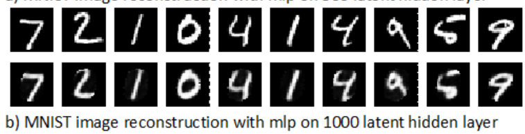
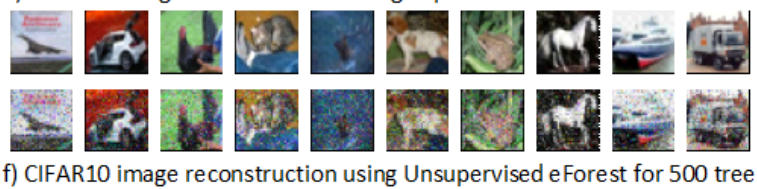

# Forest Auto-encoder

An autoencoder is an unsupervised class of artificial neural networks that code an output data similar to the input. The function of the autoencoder model is to compress the input to the latent space and try to decompress it back again from the
latent space to the original space. The target of an autoencoder is to minimize the error between compression and decompression state. This technique is performed by learning the overall representation of the data set and train the model on this
feature representation to avoid noise. 

## Table of Content
* [Forest Auto-encoder](#forest-auto-encoder)
* [2-Main Scope](#2-main-scope)
* [3-Methods](#3-methods)
* [4-Experiments and Results](#4-experiments-and-results)
  * [4.1 MNIST and CIFAR10 Image Reconstruction](#41-mnist-and-cifar10-image-reconstruction)
  * [4.2 IMDB Text Data set Reconstruction](#42-imdb-text-data-set-reconstruction)
  * [4.3 EncoderForest Damage Tolerable capability](#43-encoderforest-damage-tolerable-capability)
  * [4.4 EncoderForest Model Reuse](#44-encoderforest-model-reuse)
* [Conclusion](#conclusion)

* [Credits](#credits)

## 2-Main Scope
In this project, the main scope is to deal with tree ensemble reconstruction techniques such as forward and backward coding operations on the input sample. Generally, it includes training of the eForest in two types of models one is a supervised model and the other is an unsupervised model. From the testing result, it is shown that the eForest is more efficient and accurate compared to other DNN auto encoders such as CNN and MLP autoencoders. Similarly, in terms of damage-tolerance and reuse the eForest shows clear dominance over the DNN models. 

## 3-Methods

The general idea of implementing an autoencoder is to obtain as much as possible a smaller difference between the input of a given model and the output result. In order, to do that it needs two essential processes throughout the autoencoder model. The two techniques are encoding and decoding. For a Forest to be an autoencoder it should satisfy these two requirements encoding and decoding.

For a Forest to be an autoencoder it should satisfy these two requirements encoding and decoding. Forest by nature is an encoder since the data starts from the root node then it breaks down to sub-nodes until it reaches the leaves which are the last lower division of a tree. However, going back to the root node where the initial data starts is not a common technique in
Forest. However this can be resolved by obtain the Maximum-Compatible Rule (MCR). MCR can be defined as the intersection between two different sets of an attribute. That is the MCR will cover the elements that are common for all the sets of an attribute for given routes R1, R2, till RN.

### 3.1 Encoding Algorithm

### 3.2 Maximum-Compatible Rule (MCR) Algorithm

### 3.1 Decoding Algorithm

## 4-Experiments and Results

### 4.1 MNIST and CIFAR10 Image Reconstruction 

The testing results of eForest was obtained using different models and architectures. A Random Forest model was used to create a supervised model and completely Random forest to create the unsupervised model. The result of image reconstruction for each model is evaluated using mean squared error (MSE).

#### 1- Input samples and Reocnstructed images on MNIST

#### 2- Input samples and Reocnstructed images on CIFAR10

### 4.2 IMDB Text Data set Reconstruction 

Autoencoder for text reconstruction is not widely used application. However eForest was applied on text data to compare its performance with deep neural network autoencoders. The application of DNN autoencoders is mostly used in image reconstruction than text reconstruction. As a result, an additional mechanism is required during text reconstruction such as `word2vec` embedding. This mechanism is needed for preprocessing the texts before training the autoencoder using the IMDB text dataset. In addition, the performance of eForest was evaluated on text documents by using the IMDB data set, containing 25,000 training documents and 25,000 testing documents. Each document was stored through the use of `tf/idf` transformation as 100-dimensional vectors.

### 4.3 EncoderForest Damage Tolerable capability 

Sometimes a model could be exposed to damages due to memory loss, storage malfunction, or any type of failure. In order to restore the operation of a damaged model during malfunctioning, the rigidity and ability of the model to withstand such circumstances are very important characteristics. The eForest is one such model in its architecture since the MCR could still be determined when dealing with just a small section of trees in the forest.

  - Randomly damaged 25%, 50%, and 75% of the trees respectively during testing of each model.

#### Damage tolerance experimental results and the evaluation in MSE

  

   

   

### 4.4 EncoderForest Model Reuse 

An autoencoder that is reusable implements the encoding/decoding techniques with different dataset upon training and testing the model. In this part, the model reuse efficiency test was implemented by training a model in one dataset, and without any adjustment or retraining, the model was tested on a different dataset. The ability to use the model again is an important feature in future machine learning.

  

#### 1. Reconstructing OMNIGLOT dataset with a model trained on MNIST dataset

#### 2. Reconstructing MNIST dataset with a model trained on CIFAR10 dataset

## Conclusion

The EncoderForest model, which is the first tree ensemble based auto-encoder obtained from decision trees model with backward propagation capability. This backward propagation technique is achieved using the Maximum Compatible Rule (MCR), which is determined by taking the common path defined by all decision trees. The EncoderForest showed high performance in different tasks including supervised and unsupervised models.

## Credits

Feng J.; Zhou Z.-H. “AutoEncoder by Forest”. In: Proceedings of the AAAI Conference on Artificial Intelligence